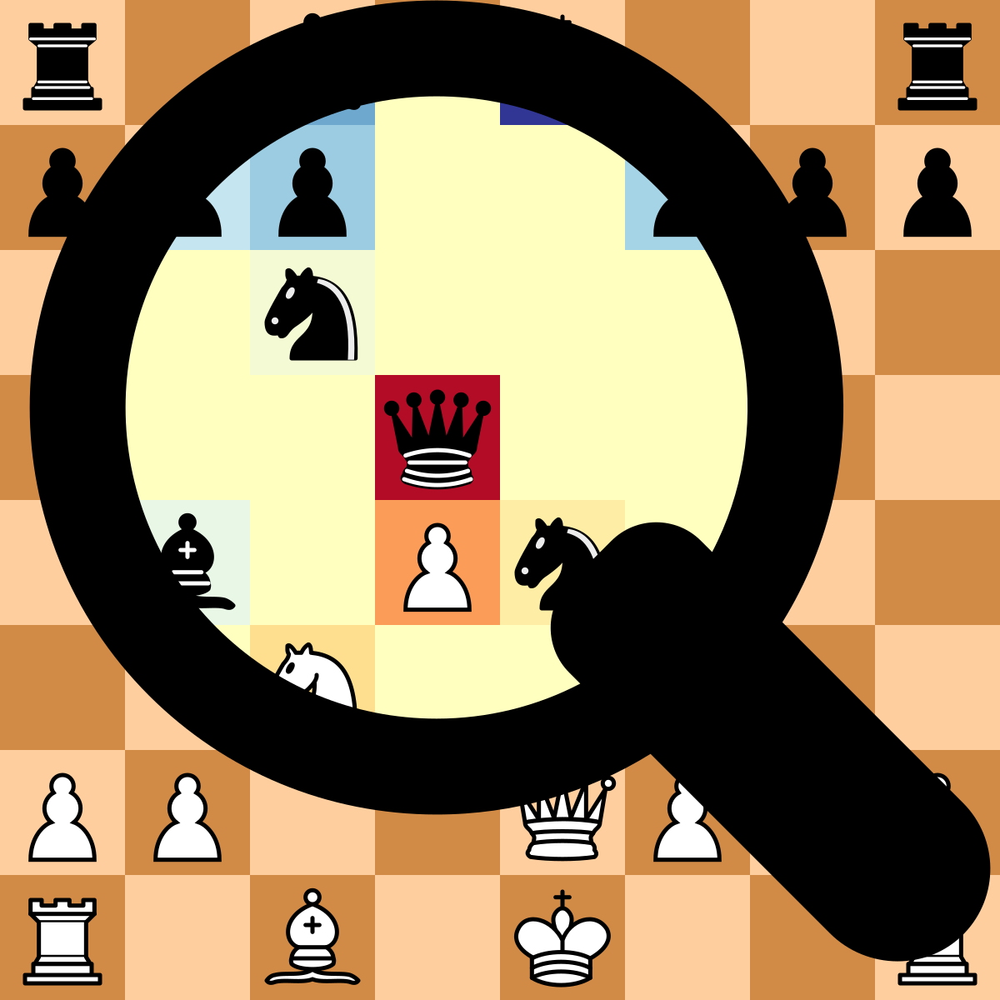

# lczerolens :mag:


<a href="https://pypi.org/project/lczerolens/"></img></a>
[](https://lczerolens.readthedocs.io/en/latest/?badge=latest)

<a href="https://lczerolens.readthedocs.io"></img></a>


Leela Chess Zero (lc0) Lens (`lczerolens`): a set of utilities to make the analysis of Leela Chess Zero networks easy.

## Getting Started

### Installs

```bash
pip install lczerolens
```

### Features

- [Render Saliency Heatmaps](https://lczerolens.readthedocs.io/en/latest/notebooks/features/render-saliency-heatmaps.html): [](https://colab.research.google.com/github/Xmaster6y/lczerolens/blob/main/docs/source/notebooks/features/render-saliency-heatmaps.ipynb)
- [Probe Concepts](https://lczerolens.readthedocs.io/en/latest/notebooks/features/probe-concepts.html): [](https://colab.research.google.com/github/Xmaster6y/lczerolens/blob/main/docs/source/notebooks/features/probe-concepts.ipynb)
- [Move Prediction](https://lczerolens.readthedocs.io/en/latest/notebooks/features/move-prediction.html): [](https://colab.research.google.com/github/Xmaster6y/lczerolens/blob/main/docs/source/notebooks/features/move-prediction.ipynb)
- [Run Models on GPU](https://lczerolens.readthedocs.io/en/latest/notebooks/features/run-models-on-gpu.html): [](https://colab.research.google.com/github/Xmaster6y/lczerolens/blob/main/docs/source/notebooks/features/run-models-on-gpu.ipynb)
- [Evaluate Models on Puzzles](https://lczerolens.readthedocs.io/en/latest/notebooks/features/evaluate-models-on-puzzles.html): [](https://colab.research.google.com/github/Xmaster6y/lczerolens/blob/main/docs/source/notebooks/features/evaluate-models-on-puzzles.ipynb)
- [Convert Official Weights](https://lczerolens.readthedocs.io/en/latest/notebooks/features/convert-official-weights.html): [](https://colab.research.google.com/github/Xmaster6y/lczerolens/blob/main/docs/source/notebooks/features/convert-official-weights.ipynb)

### Tutorials

- [Walkthrough](https://lczerolens.readthedocs.io/en/latest/notebooks/walkthrough.html): [](https://colab.research.google.com/github/Xmaster6y/docs/source/notebooks/walkthrough.ipynb)
- [Piece Value Estimation Using LRP](https://lczerolens.readthedocs.io/en/latest/notebooks/tutorials/piece-value-estimation-using-lrp.ipynb): [](https://colab.research.google.com/github/Xmaster6y/lczerolens/blob/main/docs/source/notebooks/tutorials/piece-value-estimation-using-lrp.ipynb)
- [Evidence of Learned Look-Ahead](https://lczerolens.readthedocs.io/en/latest/notebooks/tutorials/evidence-of-learned-look-ahead.ipynb): [](https://colab.research.google.com/github/Xmaster6y/lczerolens/blob/main/docs/source/notebooks/tutorials/evidence-of-learned-look-ahead.ipynb)
- [Train SAEs](https://lczerolens.readthedocs.io/en/latest/notebooks/tutorials/train-saes.ipynb): [](https://colab.research.google.com/github/Xmaster6y/lczerolens/blob/main/docs/source/notebooks/tutorials/train-saes.ipynb)

## Demo

:red_circle: Not up to date.

### Spaces

- [Lczerolens Demo](https://huggingface.co/spaces/lczerolens/lczerolens-demo)
- [Lczerolens Puzzles Leaderboard](https://huggingface.co/spaces/lczerolens/lichess-puzzles-leaderboard)

### Local Demo

Additionally, you can run the gradio demo locally. First you'll need gradio, which is packaged in the `demo` group:

```bash
git clone https://github.com/Xmaster6y/lczerolens.git
cd lczerolens
uv sync --group demo
```

And then launch the demo (running on port `8000`):

```bash
make demo
```

## Full Documentation

:red_circle: Not up to date.

See the full [documentation](https://lczerolens.readthedocs.io).

## Contribute

See the guidelines in [CONTRIBUTING.md](CONTRIBUTING.md).
